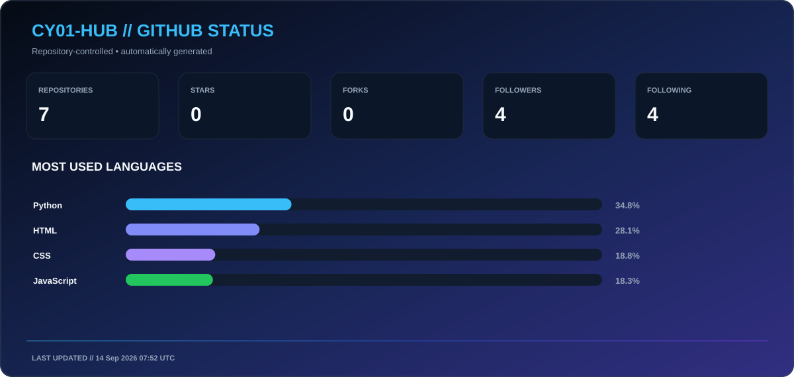
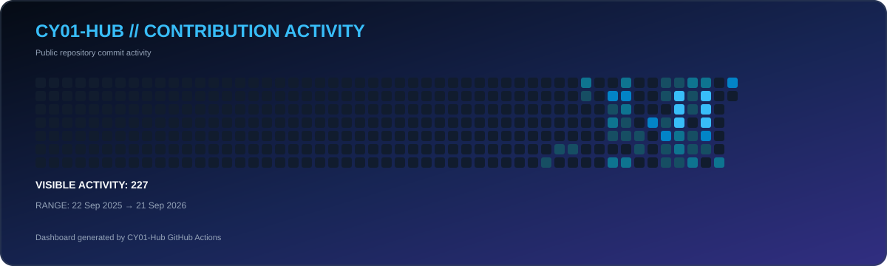

<div align="center">

<!-- ========================================================= -->

<!-- HERO -->

<!-- ========================================================= -->


<br>


<br><br>

<a href="https://cy01-hub.github.io/Portfolio/">

</a>

<a href="https://www.linkedin.com/in/dhrubo-dey/">

</a>

<a href="https://leetcode.com/u/Dhrubo-Dey/">

</a>

<br><br>


</div>

---

# 👨‍💻 About Me :-

<table>
<tr>

<td width="58%" valign="top">

### `whoami`

I'm **Dhrubo Dey**, a **3rd-year Computer Science & Engineering student** focused on **Python, Backend Engineering, Artificial Intelligence, Data Structures and Problem Solving**.

I enjoy turning ideas into practical software — especially **AI-powered applications, backend systems, document-processing pipelines and automation tools**.

My long-term career direction is **Cybersecurity**, with a growing focus on understanding how **software, systems, networks and security** work together.

I believe in learning by building:

> **Build → Understand → Secure → Improve**

</td>

<td width="42%" valign="top">

```yaml
identity:
  name: Dhrubo Dey
  codename: CY01-Hub
  field: Computer Science
  year: 3rd Year

primary:
  - Python
  - Backend Engineering
  - Artificial Intelligence

learning:
  - Data Structures
  - Algorithms
  - Linux
  - Networking
  - Cybersecurity

architecture:
  - REST APIs
  - Databases
  - AI Pipelines
  - Document Processing
```

</td>

</tr>
</table>

---

# ⚡ Technical Focus :-

<div align="center">

<table>
<tr>

<td align="center" width="25%">
<h2>🐍</h2>
<b>PYTHON</b>
<br>
<sub>Application Development</sub>
</td>

<td align="center" width="25%">
<h2>⚙️</h2>
<b>BACKEND</b>
<br>
<sub>APIs & Data Systems</sub>
</td>

<td align="center" width="25%">
<h2>🤖</h2>
<b>AI ENGINEERING</b>
<br>
<sub>Intelligent Applications</sub>
</td>

<td align="center" width="25%">
<h2>🔐</h2>
<b>CYBERSECURITY</b>
<br>
<sub>Security Fundamentals</sub>
</td>

</tr>
</table>

</div>

---

# 🛠️ Technology Stack :-

<div align="center">

### 👨‍💻 Programming Languages -


<br><br>

### ⚙️ Backend & APIs -


<br><br>

### 🗄️ Databases -


<br><br>

### 🌐 Web Technologies -


<br><br>

### 🐧 Systems & Development Tools -


</div>

---

# 🚀 Featured Projects :-

<table>
<tr>

<td width="50%" valign="top">

<h3>🩺 ClinixParse AI</h3>

<p><i>Medical Report Intelligence Platform</i></p>


<p>
AI-powered clinical document processing system designed to transform unstructured diagnostic reports into structured, machine-readable information.
</p>

<b>Core Capabilities</b>

<ul>
<li>📄 Medical Report Processing</li>
<li>🧠 AI Data Extraction</li>
<li>🩸 Laboratory Metrics</li>
<li>📊 Structured JSON</li>
<li>🔒 Privacy-Conscious Processing</li>
</ul>

<b>Stack</b>

<br>

<code>Python</code> <code>Flask</code> <code>MySQL</code> <code>SQLAlchemy</code> <code>LLM APIs</code>

<br><br>

<a href="YOUR_CLINIXPARSE_REPOSITORY_URL">

</a>

</td>

<td width="50%" valign="top">

<h3>🛣️ PathForge AI</h3>

<p><i>Career Intelligence Platform</i></p>


<p>
AI-powered career intelligence platform designed to analyze candidate information and generate actionable career strategies.
</p>

<b>Core Capabilities</b>

<ul>
<li>🎯 Candidate Evaluation</li>
<li>🧠 Skill Extraction</li>
<li>📈 Skill Gap Analysis</li>
<li>🛣️ Learning Roadmaps</li>
<li>💬 Interview Intelligence</li>
</ul>

<b>Stack</b>

<br>

<code>Python</code> <code>Flask</code> <code>MySQL</code> <code>SQLAlchemy</code> <code>LLM APIs</code>

<br><br>

<a href="YOUR_PATHFORGE_REPOSITORY_URL">

</a>

</td>

</tr>

<tr>

<td width="50%" valign="top">

<h3>📚 Synthetix AI</h3>

<p><i>AI-Powered Study Platform</i></p>


<p>
AI-powered document processing system that transforms educational material into structured learning resources.
</p>

<b>Core Capabilities</b>

<ul>
<li>📄 Document Processing</li>
<li>📝 AI Notes Generation</li>
<li>🃏 Active Recall Flashcards</li>
<li>❓ Practice Questions</li>
<li>📊 Structured Learning Material</li>
</ul>

<b>Stack</b>

<br>

<code>Python</code> <code>Flask</code> <code>MySQL</code> <code>LLM APIs</code>

<br><br>

<a href="YOUR_SYNTHETIX_REPOSITORY_URL">

</a>

</td>

<td width="50%" valign="top">

<h3>📄 ResuMate AI</h3>

<p><i>Resume & ATS Intelligence Platform</i></p>


<p>
AI-assisted resume analysis platform focused on structured candidate data, ATS optimization and actionable recommendations.
</p>

<b>Core Capabilities</b>

<ul>
<li>📄 Resume Processing</li>
<li>🎯 ATS Match Analysis</li>
<li>🧠 AI Recommendations</li>
<li>📊 Candidate Evaluation</li>
<li>⚙️ Backend Data Pipelines</li>
</ul>

<b>Stack</b>

<br>

<code>Python</code> <code>Flask</code> <code>MySQL</code> <code>SQLAlchemy</code>

<br><br>

<a href="YOUR_RESUMATE_REPOSITORY_URL">

</a>

</td>

</tr>
</table>

---

# 📈 Activity & Analytics :-

<div align="center">



<br><br>



<br>

</div>

---

# 🧠 Problem Solving :-

<div align="center">


</div>

<br>

<table>
<tr>

<td width="55%" valign="top">

### 🧩 DSA Roadmap -

<table>
<tr>
<th>Topic</th>
<th>Status</th>
</tr>

<tr>
<td>🌳 Binary Trees</td>
<td>🟢 Practicing</td>
</tr>

<tr>
<td>🔁 Recursion</td>
<td>🟢 Practicing</td>
</tr>

<tr>
<td>🔎 Searching</td>
<td>🟢 Practicing</td>
</tr>

<tr>
<td>🔃 Sorting</td>
<td>🟢 Practicing</td>
</tr>

<tr>
<td>🔗 Linked Lists</td>
<td>🟡 Improving</td>
</tr>

<tr>
<td>📚 Stacks & Queues</td>
<td>🟡 Improving</td>
</tr>

<tr>
<td>🕸️ Graphs</td>
<td>🟡 Learning</td>
</tr>

<tr>
<td>🧮 Dynamic Programming</td>
<td>🟡 Learning</td>
</tr>

</table>

</td>

<td width="45%" align="center" valign="top">

### 🧠 Problem Solving Mindset -

<br>

```text
UNDERSTAND
     ↓
ANALYZE
     ↓
IMPLEMENT
     ↓
TEST
     ↓
OPTIMIZE
     ↓
REPEAT
```

<br>

<b>Focus</b>

<br>

Patterns > Memorization

<br><br>

<b>Goal</b>

<br>

Write solutions that are
correct, readable and efficient.

</td>

</tr>
</table>

---

# 🎯 Current Learning :-

<div align="center">

<table>
<tr>

<th>AREA</th>
<th>FOCUS</th>
</tr>

<tr>
<td>🔐 <b>Cybersecurity</b></td>
<td>Security Fundamentals • Secure Development</td>
</tr>

<tr>
<td>🐧 <b>Linux</b></td>
<td>CLI • System Fundamentals • Security</td>
</tr>

<tr>
<td>🌐 <b>Networking</b></td>
<td>TCP/IP • HTTP • Network Fundamentals</td>
</tr>

<tr>
<td>🧠 <b>DSA</b></td>
<td>Algorithms • Problem Solving • Optimization</td>
</tr>

<tr>
<td>⚙️ <b>Backend</b></td>
<td>REST APIs • Databases • Application Architecture</td>
</tr>

</table>

</div>

---

# 🏆 Certifications :-

<div align="center">

<table>
<tr>

<td align="center" width="33%">

<h2>🧠</h2>

<b>Data Structures & Algorithms</b>

<br><br>

NPTEL • IIT Kanpur

<br><br>


<br>

<sub>Top 5% Ranking</sub>

</td>

<td align="center" width="33%">

<h2>💻</h2>

<b>Programming in C</b>

<br><br>

NPTEL • IIT Kharagpur

<br><br>


</td>

<td align="center" width="33%">

<h2>☕</h2>

<b>Programming in Java</b>

<br><br>

NPTEL • IIT Kharagpur

<br><br>


</td>

</tr>
</table>

</div>

---

# 🖥️ System Terminal :-

```bash
┌──[CY01-Hub@github]──[~/workspace]
│
├── $ whoami
│   └── Computer Science Student
│
├── $ identity
│   └── Dhrubo Dey // CY01-Hub
│
├── $ primary
│   ├── Python
│   ├── Backend Engineering
│   └── Artificial Intelligence
│
├── $ build
│   ├── AI Applications
│   ├── REST APIs
│   ├── Data Pipelines
│   └── Intelligent Systems
│
├── $ learning
│   ├── Cybersecurity
│   ├── Linux
│   ├── Networking
│   ├── Data Structures
│   └── Algorithms
│
├── $ philosophy
│   └── BUILD → UNDERSTAND → SECURE → IMPROVE
│
└── $ status
    └── BUILDING...
```

---

# 🤝 Let's Connect :-

<div align="center">

I'm interested in **Cybersecurity, Backend Engineering, AI Systems and Software Development.**

<br>

<a href="https://cy01-hub.github.io/Portfolio/">

</a>

<a href="https://www.linkedin.com/in/dhrubo-dey/">

</a>

<a href="https://leetcode.com/u/Dhrubo-Dey/">

</a>

<br><br>


</div>

---

<div align="center">

```text
CY01-Hub // SYSTEM STATUS

BUILD SYSTEMS.
UNDERSTAND SYSTEMS.
SOLVE HARD PROBLEMS.
SECURE WHAT YOU BUILD.

STATUS :: BUILDING...
```

© 2026 **Dhrubo Dey** • **CY01-Hub**

<br>


</div>
