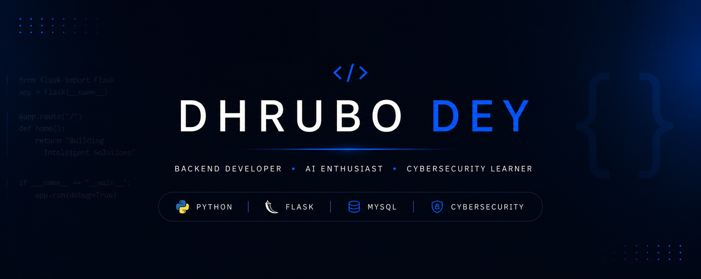

  

<!-- 

# Hi, I'm Dhrubo Dey 👋

### Python Developer • AI Enthusiast • Backend Developer • Cybersecurity Learner

 -->

---

# 💫 About Me

I'm a Computer Science & Engineering student focused on backend software development, artificial intelligence, and cybersecurity.

I enjoy designing and developing intelligent web applications that combine clean user experiences with reliable backend systems. My current work primarily involves building AI-powered platforms using Python and Flask while continuously strengthening my understanding of software engineering, databases, and computer science fundamentals.

---

# 📫 Connect With Me

---

# 💻 Tech Stack

### Languages

### Frontend

### Backend & Database

### Tools

---

# 🌟 Featured Projects

## 🩺 ClinixParse AI

An AI-powered healthcare platform that transforms complex medical reports into clear, easy-to-understand insights, helping users better understand their health information.

### Features

- Upload PDF/DOCX Medical Reports
- AI-Powered Medical Report Analysis
- Health Summary & Key Insights
- Detection of Abnormal Test Values
- Secure Medical History
- User Authentication

---

## 💼 PathForge AI

An AI-powered career development platform designed to help users build stronger resumes and improve job readiness through intelligent analysis and personalized recommendations.

### Features

- ATS Compatibility Analysis
- Resume Review & Feedback
- Missing Skills Identification
- Job Description Matching
- AI-Powered Career Suggestions

---

## 📚 Synthetic AI

An intelligent study assistant that converts educational documents into structured learning materials, making studying more efficient and interactive.

### Features

- Upload Study Materials
- AI-Generated Smart Notes
- Flashcards
- Important Questions
- AI Summaries
- Organized Learning Dashboard

---

# 🏆 Achievements & GitHub Stats

### Most Used Languages

### GitHub Contribution Overview
  

---

# 📊 Contribution Graph

---

### "Building intelligent software through continuous learning."

Thanks for visiting my profile.

